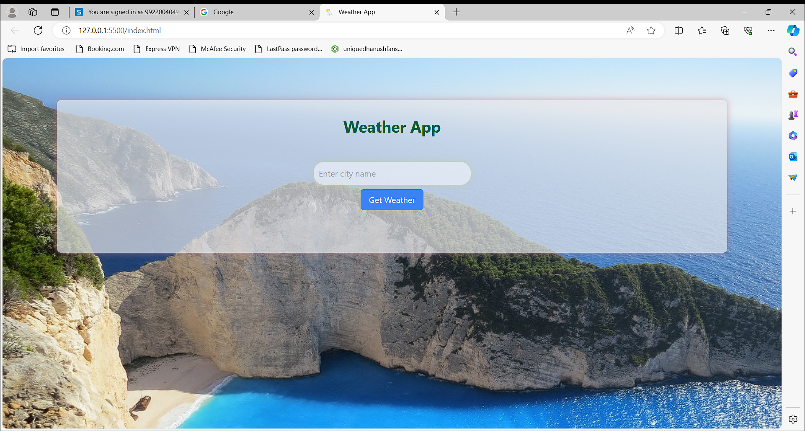
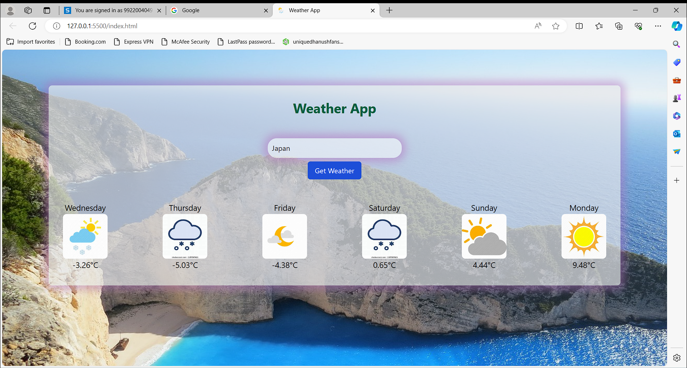

# 🌦️ Weather Forecasting Website using Node.js & Express.js

A web application that provides real-time and location-based weather forecasts using the **Tomorrow.io API**. Built with **Node.js** and **Express.js**, it offers a user-friendly and responsive interface for easy access to weather data.

---

## 🚀 Features

- **Real-time Weather Data**  
  Integrates with the Tomorrow.io API to fetch accurate and up-to-date weather forecasts for locations worldwide.

- **Location-Based Forecast**  
  Users can input any city or country to receive tailored weather forecasts specific to that area.

- **Comprehensive Weather Display**  
  Displays temperature, humidity, and general weather conditions in a clean and visual format for better readability.

- **User-Friendly Interface**  
  Designed with responsiveness in mind, ensuring a smooth experience across devices like desktops, tablets, and mobiles.

---

## 🔮 Future Enhancements

Planned features include:

- User authentication  
- Personalized weather dashboards  
- Historical weather data analysis  
- Real-time weather alerts  

---

## 🛠️ Tech Stack

- Node.js  
- Express.js  
- Tomorrow.io Weather API  
- HTML / CSS  

---

## 📸 Screenshots

### 🌤️ Home Interface  


### 📈 Weather Result Display  


---

## 🎬 Demo Video

📺 Click below to **watch/download the full project demo**:

➡️ [View Full Demo](assets/demo/Full_Demo_Weather_Project.mkv)

---

## 🚀 Getting Started

```bash
git clone https://github.com/DhanushKrishna07/Weather.git
cd Weather
npm install
npm start
